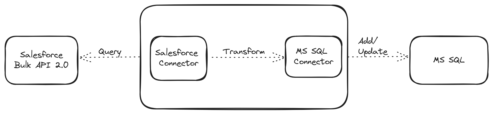
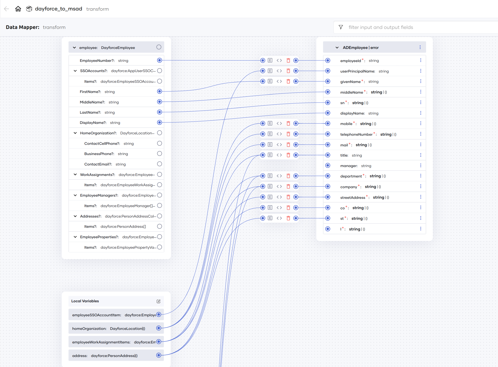

# Salesforce to MS SQL

This branch consists of an implementation of a Salesforce to MS SQL integration, syncing data from Salesforce to MS SQL.

This has been implemented as a `main` function that can be run as a task manually or as a scheduled task.

## Overview

This implementation retrieves `Contact` data from Salesforce, transforms it to the format expected by the database, and then either updates existing data or adds new data to the database. 



- An update happens only if the last updated time (`lastUpdatedTime`) value of an entry (identified by the ID) in the database is not the same as the `LastUpdatedTime` of the entry from Salesforce.

- Data is retrieved in chunks (pagination) and each chunk is processed and relevant updates are done in the database before moving on to the next chunk. If required, the maximum number of records per chunk (page) can be specified via the `sfMaxRecords` configurable variable.

- You can optionally specify the update window in hours via the `updateWindowInHours` configurable variable, which if specified, will be incoporated into the Salesforce Object Query Language (SOQL) query to retrieve only the entries that were added/updated within the specified number of hours. 

    E.g.,

    ```soql
    SELECT Id, FirstName, LastName, Phone, Fax, Email, Title, MailingStreet, MailingCity, 
        MailingState, MailingCountry, IsDeleted, LastModifiedDate, OtherPostalCode 
        FROM Contact WHERE LastModifiedDate > 2024-05-20T07:40:01.797503142Z
    ```

- You can also specify the batch size for database updates via the `dbBatchSize` configurable variable.

## Key considerations and features

- Ability to do a

    i. full sync - sync all the records from Salesforce to MS SQL

    ii. partial sync - sync all the record that have been updated within a specified number of hours

- Ability to control

    i. maximum number of records to retrieve per chunk from Salesforce

    ii. batch size for database updates

- Transforming data from Salesforce to the format expected by the database is done using a data mapper.

    

- Error handling, including detailed failure descriptions for the following scenarios:

    - Missing required fields from Salesforce
    - Unexpected values from Salesforce (e.g., a value that cannot be passed as a number for a field that expects a number)
    - Additional fields (if the query retrieves all/additional fields) - these fields are ignored in the transformation/sync

- Email notification of failures, both full and partial. This implementation uses the GMail API (and connector), but alternatively, it is possible to use [an SMTP client](https://ballerina.io/learn/by-example/send-email/) from the `ballerina/email` module.

- Error return from the main function, that results in an error status code, which can then be used to identify if a retry is required. [Choreo](https://wso2.com/choreo/) already does this when you deploy this program as a manual or a scheduled task.

## Running the program

### Database 

The schema of the `Contact` table is assumed to be the following.

```sql
CREATE TABLE [Contact] ( 
    [id] VARCHAR(191) NOT NULL, 
    [name] VARCHAR(191) NOT NULL, 
    [phone] VARCHAR(20), 
    [fax] VARCHAR(20), 
    [email] VARCHAR(50), 
    [title] VARCHAR(50), 
    [address] VARCHAR(255), 
    [backupPostalCode] INT, 
    [isDeleted] BIT NOT NULL, 
    [lastModifiedDate] DATETIME2 NOT NULL, 
    PRIMARY KEY([id]) 
);
```

### Configurable values

#### Mandatory configurable values

The following configurable values are mandatory.

```toml
dbHost = "<DB_HOST>"
dbPort = DB_PORT
dbUser = "<DB_USER>"
dbPassword = "<DB_PASSWORD>"
dbDatabase = "<DB_DATABASE>"

[sfConnectionConfig]
baseUrl = "<SF_BASE_URL>"

[sfConnectionConfig.auth]
clientId = "<SF_CLIENT_ID>"
clientSecret = "<SF_CLIENT_SECRET>"
refreshToken = "<SF_REFRESH_TOKEN>"
refreshUrl = "<SF_REFRESH_URL>"
```

#### Optional configurable values

- A value can be specified for `updateWindowInHours`, in order to retrieve only the entries that were updated/added within the specified number of hours.

    ```toml
    updateWindowInHours = 96
    ```

- The maximum number of records to be retrieved per chunk from Salesforce can be configured by specifying a value for `sfMaxRecords`.

    ```toml
    sfMaxRecords = 500
    ```

- The batch size for database updates can be configured by specifying a value for `dbBatchSize` (the default is 1000). Note that the MS SQL connector internally has a batch size of `1000` and if the value specified as `dbBatchSize` is more than 1000, the MS SQL connector will still use a batch size of 1000. 

    ```toml
    dbBatchSize = 10
    ```

    There is an [open issue](https://github.com/ballerina-platform/ballerina-library/issues/4133) to track adding support to configure this at connector level itself.

- In order to send an email notification on failure, configure the following values for the GMail connector. If not specified, the sync will still happen, but emails will not be sent.

    ```toml
    [emailConfig]
    toEmailAddresses = ["<EMAIL_ADDRESS_1>", "<EMAIL_ADDRESS_2>"]

    [emailConfig.gmailAuthConfig]
    refreshToken = "<GMAIL_REFRESH_TOKEN>"
    clientId = "<GMAIL_CLIENT_ID>"
    clientSecret = "<GMAIL_CLIENT_SECRET>"
    ```

### Running

Use the `bal run` command to run this program.

```cmd
ballerina-sync-samples$ bal run
```

See [Develop a scheduled task](https://wso2.com/choreo/docs/develop-components/develop-integrations/develop-a-scheduled-task/) and [Develop a manual task](https://wso2.com/choreo/docs/develop-components/develop-integrations/develop-a-manual-task/) for deploying on Choreo.

## Running tests

**Note:** Provide the configuration for a test database. Note that the tests update and/or remove entries from the configured database.

Since the Salesforce and GMail client calls are mocked, provide placeholder string values for the relevant configuration.

```toml
dbHost = "<TEST_DB_HOST>"
dbPort = TEST_DB_PORT
dbUser = "<TEST_DB_USER>"
dbPassword = "<TEST_DB_PASSWORD>"
dbDatabase = "<TEST_DB_DATABASE>"

[sfConnectionConfig]
baseUrl = ""

[sfConnectionConfig.auth]
clientId = "placeholder"
clientSecret = "placeholder"
refreshToken = "placeholder"
refreshUrl = "placeholder"

[emailConfig]
toEmailAddresses = ["placeholder"]

[emailConfig.gmailAuthConfig]
refreshToken = "placeholder"
clientId = "placeholder"
clientSecret = "placeholder"
```

Use the `bal test` command to run the tests.

```cmd
ballerina-sync-samples$ bal test
```
