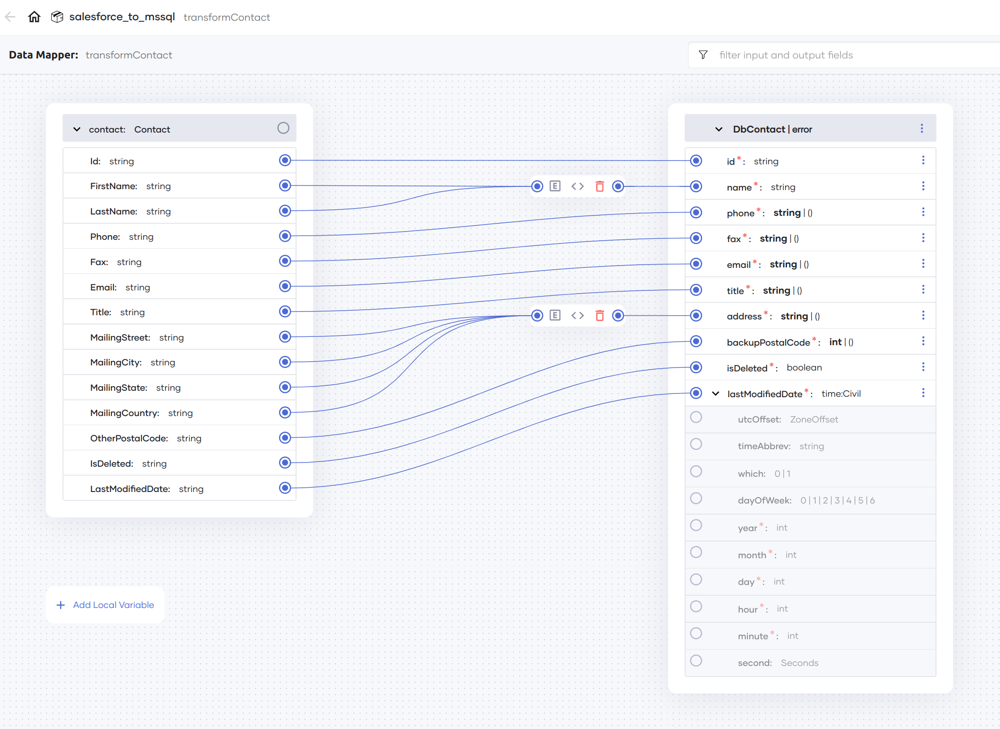

# Dayforce to MS AD

This branch consists of an implementation of a Dayforce to MS AD integration, syncing data from Dayforce to MS AD.

This has been implemented as a `main` function that can be run as a task manually or as a scheduled task.

## Overview

This implementation retrieves updated data (since the last sync) from Dayforce, transforms it to the format expected by MS AD, and then updates the data on MS AD. 


- Data is retrieved in chunks (pagination) and each chunk is processed and relevant updates are done in MS AD before moving on to the next chunk. If required, the page size can be specified via the `dayforcePageSize` configurable variable.

- The time and interval to wait for for Dayforce job completion can also be configured via the `dayforceJobCompletionWaitTime` and `dayforceJobCompletionWaitInterval` configurable variables.

## Key considerations and features

- Ability to specify page size and handle paginated data.

- Transforming data from Dayforce to the format expected by MS AD is done using a data mapper.

    

- Error handling, including identification of failures for specific entries (by employee ID).

- Error return from the main function, that results in an error status code, which can then be used to identify if a retry is required. [Choreo](https://wso2.com/choreo/) already does this when you deploy this program as a manual or a scheduled task.

## Running the program

### Configurable values

#### Mandatory configurable values

The following configurable values are mandatory.

```toml
dayforceServiceUrl = "<DAYFORCE_SERVICE_URL>"
dayforceUsername = "<DAYFORCE_USERNAME>"
dayforcePassword = "<DAYFORCE_PASSWORD>"

adHostName = "<AD_HOST>"
adPort = <AD_PORT>
adDomainName = "<AD_DOMAIN>"
adPassword = "<AD_PASSWORD>"
```

#### Optional configurable values

- A value can be specified for `dayforcePageSize`, to get paginated data. If unspecified, no page size will be specified when creating the Dayforce job.

    ```toml
    dayforcePageSize = 100
    ```

- Values can be specified in seconds for `dayforceJobCompletionWaitTime` and `dayforceJobCompletionWaitInterval` to control how long to wait for for the Dayforce job to complete and how often to check for completion. If unspecified, they default to `300` and `15` respectively.

    ```toml
    dayforceJobCompletionWaitTime = 120
    dayforceJobCompletionWaitInterval = 10
    ```

- The MS AD OU (organizational unit) can be specified via the `adOU` variable. By default, this is set to `People`.

    ```toml
    adOU = "<AD_OU_VALUE>"
    ```

### Running

Use the `bal run` command to run this program.

```cmd
dayforce-to-msad$ bal run
```

See [Develop a scheduled task](https://wso2.com/choreo/docs/develop-components/develop-integrations/develop-a-scheduled-task/) and [Develop a manual task](https://wso2.com/choreo/docs/develop-components/develop-integrations/develop-a-manual-task/) for deploying on Choreo.
